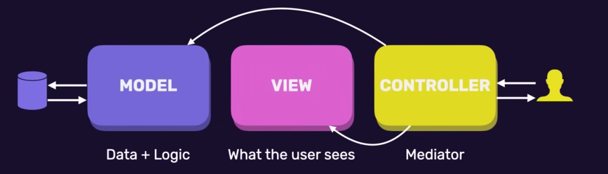

# Spring-store
spring store for learning purpose and application 

# folder structure
.mvn/wrapper folder has the wrapper that tells the configuration of the maven we are going to use. 

in scr folder we have mvnw and mvnw.cd which are both bash scripts which automatically downloads/configures the version of maven 

pom.xml (project object model): configuration/dependencies of the maven project. this builds the project. 

in test/ we write automated tests
in main/ folder we write the actual source code. 

in /main/java we have java files and in /resources we got non java files 

the application.properties file is a conf file and has key value pairs, here we can specify the server port db settings and so on. 

in the store/demo/demoapplication.java is the entry point to our application. 

# dependencies
we can add starter packs like **spring-boot-starter-web** which is a combination of all other libraries like tomcat, web , webmvc, logging etc. 
**maven-central** can be used to search for libraries. 

# Spring mvc
Part of spring framework which stands for model view controller, it is how web requests are handled. 

